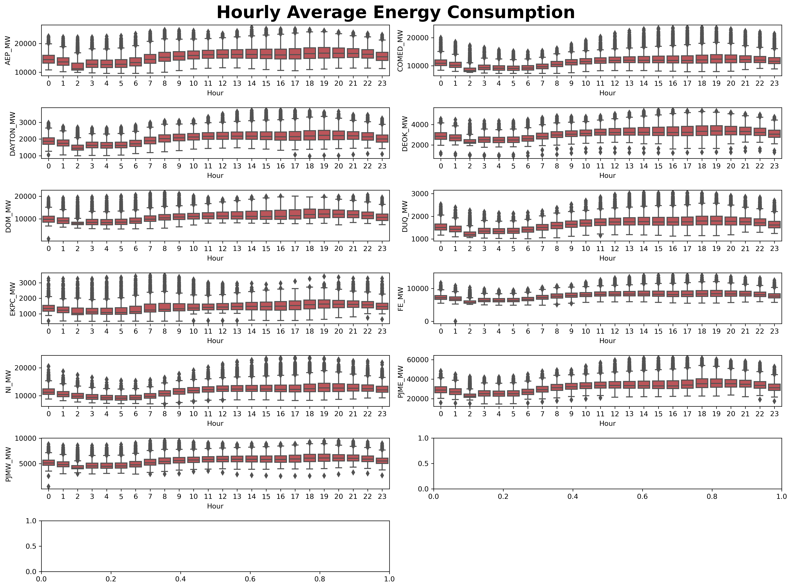
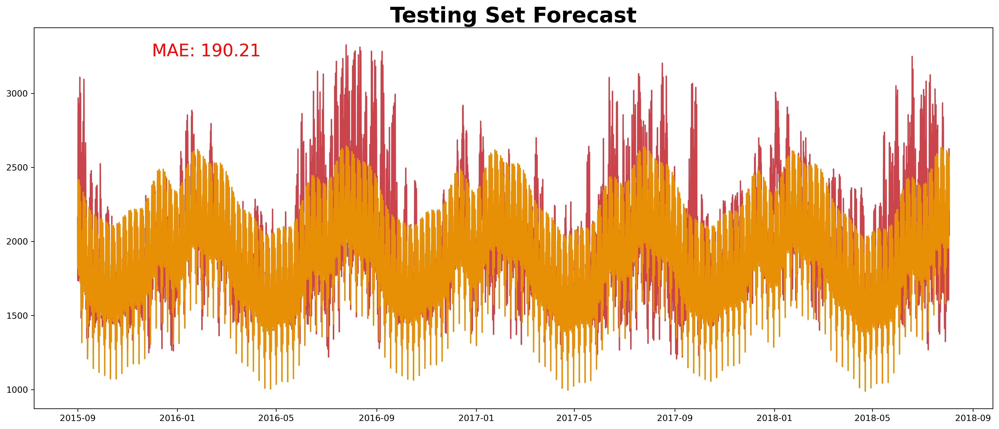
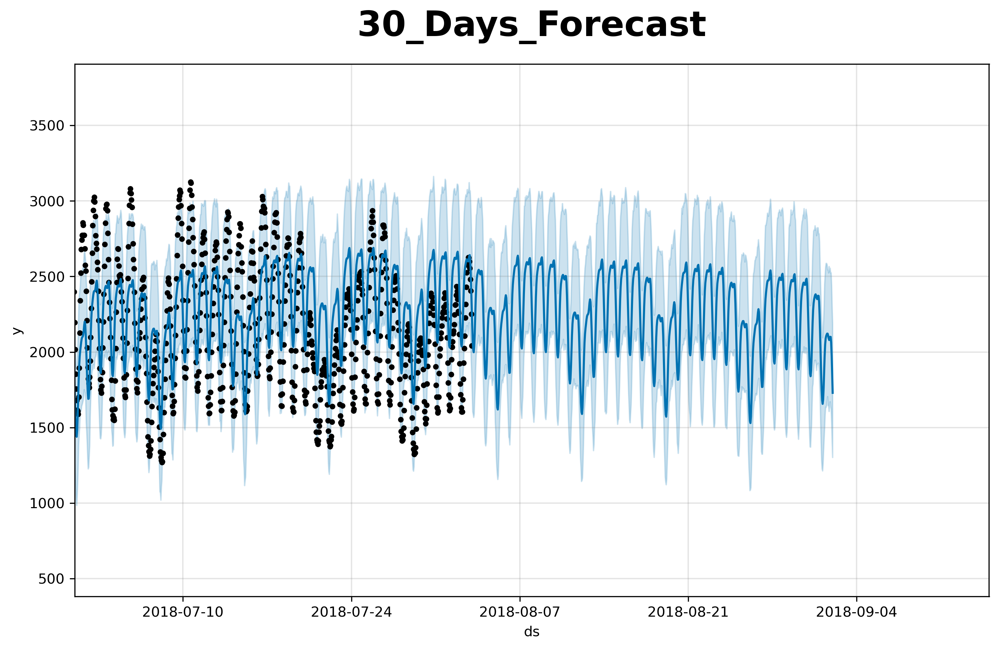

# Hourly Energy Consumption from PJM's Eastern Interconnection Grid 
==============================
                                                                    
This repository contains code for univariate time series modeling of hourly energy consumption data (in Megawatts) from PJMs Eastern Interconnection Grid. The aim of this project is to build a model that can accurately forecast hourly energy consumption (in Megawatts) based on historical data.

<p align="center">
  
</p>

<p align="center">
  
</p>

## Dataset
The data used in this project is a time series dataset containing hourly energy consumption data from PJMs Eastern Interconnection Grid, spanning over 10 years. The dataset is available in the dataset folder of this repository.

## Methodology
The analysis was performed using Facebook's Prophet library in Python. Prophet is a powerful tool for time series forecasting that accounts for seasonality, trends, and holidays.

The following steps were followed to perform the modelling:

1. Data preprocessing: cleaning, formatting, and resampling the data to hourly frequency
2. Exploratory data analysis: The data was visualized to gain insights into the patterns and trends in the data.
3. Model fitting: training the Prophet model on the preprocessed data
4. Model validation: evaluating the accuracy of the model using metrics such as Mean Absolute Error (MAE) and Root Mean Squared Error (RMSE)
5. Forecasting: generating future predictions based on the fitted model

## Result
The model achieved good accuracy on the validation data, with an MAE of 190 and an RMSE of 249. The forecasted values for the next Z hours are available in the "models" folder of this repository.

<p align="center">
  
</p>
                      
<p align="center">
  
</p>
      

## Usage                                   
**Clone this repository to your local machine.**                                            
```bash     
git clone https://github.com/obinopaul/hourly_energy_consumption.git                                       
```      

**Install the required packages.**                                                        
```bash    
pip install -r requirements.txt                         
```    
**Run the notebook.**  
Run the ```hourly_energy_consumption_2.ipynb``` notebook to preprocess the data, fit the model, and generate predictions

## Conclusion
In this project, we successfully built a univariate time series model using Prophet to forecast hourly energy consumption in PJMs Eastern Interconnection Grid. The model achieved good accuracy on the validation data, and the predictions for the next several hours are available for use.
"# hourly_energy_consumption" 
